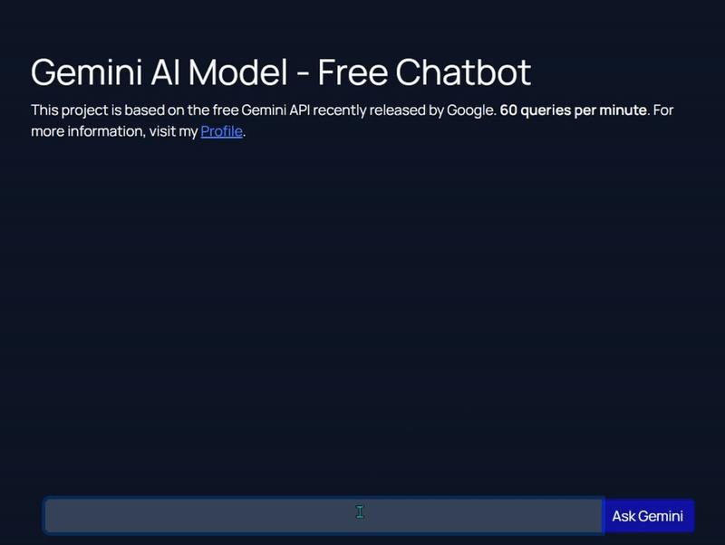

# Gemini AI Chatbot
**Demo Link:** [Website Demo](https://whale-app-htuk7.ondigitalocean.app/)


## Overview
This repository contains a basic implementation of a web app using the Gemini AI chatbot API. The web app is built using the Flask framework in Python. The Gemini AI chatbot is powered by the Gemini Pro API, allowing users to interact with a chatbot trained on a massive dataset of 1.5 Trillion tokens.

Please note that the Gemini API allows 60 queries per minute.

## Local Setup

### Step 1: Clone the Repository
```bash
git clone https://github.com/FareedKhan-dev/Gemini-AI-chatbot.git
```

### Step 2: Add API Key
Replace the following line of code in app.py with your Gemini API key:
```python
my_api_key_gemini = os.getenv('my_new_api_key_here')
```
Replace it with:

```python
my_api_key_gemini = "your_api_key_here"
```
You can obtain your API key from [here](https://makersuite.google.com/app/apikey). Once you have the key, proceed to the next step.


### Step 3: Install Dependencies
```bash
pip install -r requirements.txt
```
### Step 4: Run the Web App
In the terminal, execute the following command:

```
python app.py
```

This will launch a web app locally. Open your browser and navigate to the provided address (usually http://localhost:5000/) to interact with the Gemini AI chatbot.

Feel free to explore and customize the code according to your needs. Contributions are welcome!

**Notes**
* Ensure that you have Python installed on your system.
* Use a virtual environment for better isolation of dependencies.
